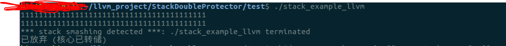
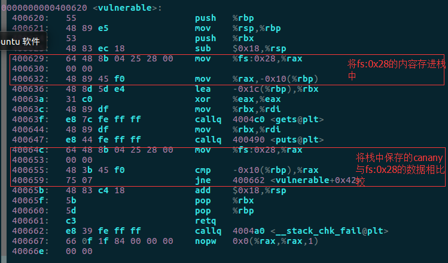

## Simplified LLVM StackProtector

This is a simplified llvm Stackprotector which can only run on the x86_64 machine, if you want to build this project on your own machine, you can follow the following steps:

1. You should make sure that llvm is properly built on your machine. The tuotorial can be found from the [link](http://llvm.org/docs/CMake.html#quick-start)

2. First, clone the git repository into your workspace
```
git clone https://github.com/bin2415/llvm-stack-guard.git
```

3. Second, mkdir a dirtory named build and cmake in it
```
mkdir build && cd ./build
cmake ../
make
```
4. Then, you can find a .so file in /build/SSPPass/

5. In test folder, you can find the test file named stack_example.c

6. Compile it through clang
```
clang -S -emit-llvm -o stack_example.ll stack_example.c
```

7. Use the pass to protect stack.
```
opt -load ../build/SSPPass/libSSPass.so -SSPPass stack_example.ll -S -o stack_example_protect.ll
```

8. Use the llc tool to generate .o file
```
llc -filetype=obj stack_example_protect.ll -o stack_example_protect.o
```

9. Use clang to generate a binary file
```
clang -o stack_example_llvm stack_example_protect.o
```

10. Run the example file and input 111111111111111111111111 to corrupt the program
```
./stack_example_llvm
111111111111111111111111111111111
```
And the result is shown as belows:



11. You can disassemble the binary to find code that implement the stack smashing protect
```
objdump -S stack_example_llvm > stack_example_llvm.s
vi stack_example_llvm.s
```

